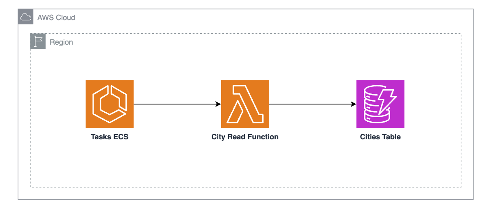

### Hiperium City Management.

* **Author**: [Andres Solorzano](https://www.linkedin.com/in/aosolorzano/).
* **Level**: 300 - Senior.
* **Technologies**: GraalVM, Spring Boot, Spring Cloud, Spring Native, Spring Modulith, Docker, Testcontainers, LocalStack, Amazon DynamoDB, AWS Lambda, and AWS SAM.



---
### Description.
This project uses Spring Cloud Functions to create an AWS Lambda Function for the Hiperium City Management module.

---
### Prerequisites.
- Git.
- AWS SAM CLI.
- GraalVM with OpenJDK (version 21.+). You can use SDKMAN.
- Apache Maven. You can install it using SDKMAN.
- Docker Engine with the Compose Plugin.

---
### Project Structure.
The project is divided into the following files/directories:

- **functions**: Directory used Lambda functions.
- **utils**: Directory used for script files and other project documentation.
- **common**: Directory used for common project files.


---
### GraalVM Tracing Agent.
The Tracing Agent monitors our application’s behavior to see what classes, methods, and resources are being accessed dynamically. 
Then, it outputs configuration files that describe this dynamic behavior. 
These config files can be provided to the native-image utility when building a native image. 
First, execute the following command from the `project's root` directory to start the application with the Tracing Agent:
    
```bash
mvn clean process-classes                    \
    -f functions/city-data-function/pom.xml  \
    -P tracing-agent
```

In another terminal window, invoke the Lambda Function from the `project's` root directory:
```bash
curl -H "Content-Type: application/json" "http://localhost:8080/findByIdFunction" \
  -d @functions/city-data-function/src/test/resources/requests/valid/lambda-valid-id-request.json
  
curl -H "Content-Type: application/json" "http://localhost:8080/findByIdFunction" \
  -d @functions/city-data-function/src/test/resources/requests/non-valid/wrong-city-uuid.json
```

At this point, the Tracing Agent will generate the necessary configuration files for the native-image utility.
You can exit the application after the request is completed by pressing `Ctrl+C`.
Finally, copy the output files into the `META-INF/native-image` directory to be included by the native-image utility:
```bash
cp -rf functions/city-data-function/target/native-image/* \
       functions/city-data-function/src/main/resources/META-INF/native-image
```

After this, you can build the native image using as usual and make tests with the AWS Lambda Function.

---
### Deployment Options.
So far, we have only one deployment option for the Lambda Function as this project is in development.
This option is using SAM CLI to deploy the Lambda Function to AWS.
You can execute the following script to show you the deployment options:
```bash
./setup.sh
```

Select the default option to deploy the Lambda Function to AWS.

---
### Maven Parent overrides

Due to Maven's design, elements are inherited from the parent POM to the project POM.
While most of the inheritance is fine, it also inherits unwanted elements like `<license>` and `<developers>` from the parent.
To prevent this, the project POM contains empty overrides for these elements.
If you manually switch to a different parent and actually want the inheritance, you need to remove those overrides.
